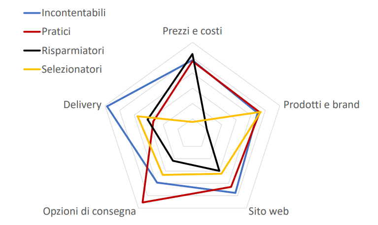
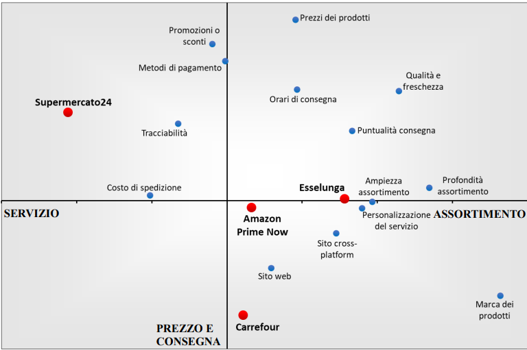

# The relevance of home delivery e-commerce services in the grocery retail industry.
Gregorio Nastasi, December 2019, Masters' thesis

Disclaimer: this text has been translated from Italian to English through AI. It may contain some inaccuracies.

## 0. Overview and Objectives
This work aims to provide a descriptive analysis of the e-commerce channel in the large-scale retail sector and to identify the critical aspects of both demand and supply, focusing on the scenario in Lombardy.

Following a review of the relevant literature and the digital commercial services offered by major distributors, both qualitative and quantitative research will be conducted to analyze the Lombard market. This research will focus on the importance attributed to the e-commerce services of the respective players in the large-scale distribution sector (food and home/personal care products), as well as their digital-only competitors that do not have physical stores and operate exclusively online.

In conclusion, the most influential characteristics in the evaluation of this type of commercial service will be identified, along with the user profiles and brand positioning dynamics within the service offering.

Many companies in Italy have integrated online grocery shopping services into their offerings, following a trend seen abroad. This strategy underpins the optimization of multichannel management — that is, the integration of multiple touchpoints between the brand and the customer.

The e-commerce channel has been widely adopted across many sectors, but in Italian large-scale retail, it was introduced relatively recently, unlike in the European market, which has experienced steady growth year after year.

It is important to emphasize that this new online channel tends to cannibalize the traditional physical channel, with the potential to shift a significant number of purchases from physical stores to websites. This trend has accelerated with the introduction of smartphones and mobile channels, forcing brick-and-mortar companies to react to this shift, which is having a major impact on offline purchases.

This work will begin with a brief initial chapter that introduces the history and types of distribution formats in organized large-scale retail, followed by a concise analysis of recent market trends and an explanation of the marketing levers in the retailing mix.

The second chapter will explore, through a review of existing literature, digital commercial services, including their advantages and disadvantages, and how they can integrate into a multichannel strategy.

The third part of the study will outline the e-commerce offerings of the main players in Lombardy’s retail sector, describing and analyzing them in comparison to others.

From the fourth chapter onward, the methodology and results of a brief qualitative study (which serves as a foundation for the quantitative research in Chapter Five) will be presented. This quantitative research will aim to investigate the relevance of value drivers in the digital channels and services offered by large-scale retailers in Lombardy — particularly home delivery services in e-commerce — their market positioning, and finally, define a classification of the types of users who utilize such services.

This will be followed by analysis of the results and conclusions, including managerial implications for current or potential players in the industry to help improve and define their value proposition, along with targeted marketing actions for each identified customer cluster.

The goals of the research and the main contributions this work aims to provide can be summarized into three main areas:

- To understand whether users of home delivery services for online grocery shopping can be grouped into clearly defined and profiled clusters;

- To outline models that explain overall satisfaction with certain e-grocery services in Lombardy, identifying which factors are most important to customers;

- To provide a positioning analysis of the e-grocery services available in the Lombard market.

---

## 1 Introduction: The Italian Grocery Retail Market

### 1.1 Brief History and Types of Retail Formats

Following the birth of the department store in France in the second half of the 19th century, and its subsequent development in the United States, a primitive form of the supermarket retail format emerged in the early 1900s in America with the opening of the first grocery stores such as Piggly Wiggly[^1].

The arrival of supermarkets in Italy, adapted and transferred from the American model, came several decades later, between 1957 and 1963[^2]. The first store of this kind was inaugurated on November 27, 1957, in Milan on Viale Regina Giovanna by Supermarkets Italiani, later known as Esselunga, which at the time was managed by Nelson Rockefeller and the Caprotti brothers[^3].

Subsequently, between the 1970s and 1990s, other retail formats were introduced in Italy such as cash and carry, hypermarkets, discount stores, superstores, and shopping centers, along with product assortment expansions like the introduction of private labels. In 2017, Italy had about 57,400 food and non-food retail outlets, with approximately 35% made up of supermarkets and small self-service stores (food sector). Lombardy is the region with the highest retail density, boasting over 3,000 food outlets and more than 5,400 non-food outlets, representing 14.9% of the total grocery retail stores in Italy[^4].

Below is a brief classification of the most common retail formats (definitions adapted from *Retail and Channel Management* by Castaldo S.):

- **Supermarket:** A self-service retail store primarily focused on food products, usually with a sales area between 400 and 2,500 m². In 2017, Italy had 8,118 supermarkets.
- **Self-service Store:** Similar to supermarkets but with a sales area smaller than 400 m². In 2017, Italy had 11,998 such stores.
- **Hypermarket:** A self-service retail store focused on food products with a sales area greater than 4,500 m². It offers additional services like assisted fresh product counters, a wide assortment, and longer opening hours compared to classic supermarkets. In 2017, Italy had 367 hypermarkets.
- **Superstore:** Also called mini-hypermarkets, these self-service retail stores cover both food and non-food categories, with sales areas between 2,500 and 4,500 m². In 2017, Italy had 529 superstores.
- **Discount Store:** A self-service food retail store characterized by limited services, a restricted assortment mostly composed of non-branded products, and a simple store layout. In 2017, Italy had 5,039 discount stores.
- **Cash and Carry:** Wholesale self-service warehouses accessible only to professionals such as retailers and resellers. These outlets are large in size. In 2017, Italy had 380 cash and carry stores.
- **Department Store:** A retail store with at least 5 non-food departments and a sales area larger than 400 m², featuring assisted sales.
- **Large Specialized Store:** A non-food retail outlet with self-service and a sales area of at least 250 m², focused strongly on one product category with deep assortment.

### 1.2 Market Trends and Evolution: Recent Developments

In the last 5 years, the Italian grocery retail market grew by 6%, from about 128 billion euros in 2013 to nearly 136 billion euros in 2018[^5]. In terms of market share, in 2018, the CONAD group surpassed Coop Italia, achieving a value market share of 9.3% against Coop Italia’s 9.2%, which had been the market leader until the previous year. Other players include Selex (7.0%), Esselunga SpA (5.5%), Gruppo Végé (3.7%), and Carrefour SA (3.5%)[^6].

Market share by group in 2018:

| Group                            | Market Share |
|---------------------------------|--------------|
| CONAD - Consorzio Nazionale      | 9.3%         |
| Coop Italia scarl                | 9.2%         |
| Selex Gruppo Commerciale SpA    | 7.0%         |
| Esselunga SpA                   | 5.5%         |
| Gruppo VéGé                     | 3.7%         |
| Carrefour SA                   | 3.5%         |
| Gruppo Eurospin                | 3.4%         |
| Others                         | 58.3%        |

Brand share in 2018:

| Brand     | Brand Share |
|-----------|-------------|
| CONAD     | 7.8%        |
| Esselunga | 5.5%        |
| Ipercoop  | 4.6%        |
| Coop      | 4.1%        |
| Eurospin  | 3.4%        |
| Lidl      | 3.1%        |
| Crai      | 2.2%        |
| Others    | 69.3%       |

The market remains highly competitive and fragmented, with no single distributor clearly dominating.

The 2019 Passport Country Report on Traditional Grocery Retailers in Italy[^8] shows consumers favor “premium” food products and are more willing to spend on local products that guarantee better quality, while private labels continue to grow. A MarketLine study[^9] forecasts a CAGR of 1.2% from 2017 to 2022, lower than France (2.3%) and Germany (2.4%). The fastest growing channel is online retail, which accounts for 0.3% of total sales in Italy and is expected to grow by an average of 15.3% annually from 2017 to 2022, reaching 0.6% by the end of the period.

Competition is intense due to limited differentiation possibilities, nonexistent switching costs for consumers, and a highly volatile market. Retailers must maintain aggressive pricing and promotions to serve a price-sensitive and unloyal clientele. There is a moderate threat of new entrants, encouraged by low entry and exit barriers and the growth of the online segment, which poses a real challenge despite brick-and-mortar stores still dominating sales.

A Nielsen survey in 2015 across 60 countries with 30,000 respondents[^10] found that generations Y and Z are the most inclined to use e-commerce grocery services. Demand for such services is stronger in emerging markets like Asia and the Middle East/Africa than in Europe and North America. In Europe, only 6% used grocery e-commerce with home delivery, versus 37% in Asia. The study also noted growing interest in in-store digital engagement via smartphones and PCs, with tools like online coupons, mobile shopping lists, and retailer apps for promotions and loyalty programs. Despite this, only a small portion of respondents used these tools, although about two-thirds expressed willingness to do so.

The 2019 Coop Report[^11] highlights rapid growth in e-grocery, outpacing traditional channels. In 2018, one in five families shopped online for groceries, rising to one in three in 2019, with an average spend of €186 per family. This trend is driven by widespread internet access, smartphone adoption, and digital payment services. Challenges remain around delivery costs and timing. Top online product categories are grocery staples (25.8%), fresh produce (25.4%), and personal care products (23.3%).

### 1.3 Marketing Levers in Retail

Retail marketing levers differ from the traditional 4 Ps and consist of components that marketers use jointly to best position the retailer’s offer:

- **Assortment:** Choice of the extent and depth of the product offering, typically divided into categories, sectors, or departments. It must follow display criteria consistent with end-user behavior.
- **In-store Marketing and Merchandising:** This involves active product presentation rather than passive display. Merchandising promotes purchase within the store, whether impulsive or planned[^12][^13]. Activities include classification and segmentation of assortment, store layout, equipment, and displays.
- **Promotion:** Mechanisms like temporary price reductions, discount coupons, gifts (buy one get one free), free trials, bundling, etc., aimed at increasing sales, inventory turnover, product trials, or customer loyalty[^14].
- **Price:** The most impactful sales variable, often requiring the least financial investment. Retailers base pricing policies on markups or competitor price monitoring, especially for major brands.
- **Communication:** Retailers communicate to customers about commercial offers, prices, assortments, promotions, and services, or promote company mission and values.

---

## 2 Multichannel and Digital Channel in Retail

### 2.1 Multichannel: definition and applications

The management of multichannel strategies is becoming more and more relevant for the business performance of the main retailers. In addition to offering new opportunities, it also presents challenges for companies operating in large-scale retail, where competitiveness implies the ability to manage both traditional and new channels, such as online ones.

Multichannel marketing enables companies to build long-term relationships with customers (and prospects) by offering information, products, services, and support through two or more coordinated channels at the same time. The coordination of the different channels allows the company to offer higher quality services and reduce the switching of its customers, as accessing alternative channels becomes more difficult. Moreover, monitoring consumer behavior allows companies to understand customers' decision-making processes and serves as the basis for building lasting relationships[^15].

In recent years, a new concept has been introduced in the literature: omnichannel retailing, which extends multichannel to integrate a greater number of channels, especially those based on digital technologies[^16]. Omnichannel retailing has been defined as “the synergistic management of channels and customer touchpoints[^17] to optimize customer experience across channels and their performance”[^18]. Another study[^19] defines omnichannel as a complex adaptive system characterized by interdependence and interconnection between multiple factors, which can be conceptualized according to three main dimensions: channel stage, channel type, and channel agent.

- **Channel stage** refers to the phase in the purchase process in which the consumer is located (pre-purchase, payment, delivery, return), and which may involve different types of channels and actors.  
- **Channel type** refers to the different means available at each stage of the purchase process to provide the product or service, or related information.  
- **Channel agent** refers to the subject that manages the types of channels at the various stages of the process.

The management of omnichannel systems requires the use of numerous tools: internet access, distribution centers designed with strategic logic, efficient logistics systems, customer analytics, digitalization of the product, etc. This explains why companies are increasingly investing in digital services and channels, both in physical stores and online.

As for consumer behavior, the literature has identified six reasons why consumers use online channels[^20]: convenience, choice, personalization, communication, cost, and control.

1. **Convenience** is the main element that guides customer value.  
2. **Choice** includes both the selection of products and the availability of additional services and assistance.  
3. Consumers can obtain **personalized** and **interactive** product information online.  
4. **Communication** channels used in online shopping are numerous and convenient.  
5. Products or services purchased online are often available at a **lower cost** or through dynamic pricing.  
6. Finally, **control** refers to the possibility for the customer to use the virtual channel throughout the decision-making process.

Various studies have explored whether customers who use multiple channels spend more than those who use only one. It generally emerges that the value of multichannel customers is higher. This suggests that mass merchandisers should invest in all channels to encourage increased customer spending. Furthermore, those who purchase utilitarian and high-risk products (such as electronics, musical instruments, and cameras) tend to spend more online[^21].

---

### 2.2 Digital services in food retail: classification, factors, and challenges

Online services offered by grocery distribution chains can be divided into two macro-categories:

1. **Click and collect**  
2. **Home delivery**

Click and collect allows customers to browse the retailer’s website, select products, complete the purchase online, and then pick up groceries in-store. This model is also referred to as a “Drive” service (first introduced by French players), meaning that the customer physically picks up the order after paying online. Three types of delivery models are distinguished[^22]:

1. **Drive-out model**: groceries are stored in warehouses, not stores, aiming to penetrate new territories where the retailer has no physical presence[^23];  
2. **Drive-in model**: groceries are picked and placed in lockers or warehouses near the store[^24];  
3. **In-store picking model**: the order is picked directly inside the store. This is the most widespread type and is often integrated with hypermarkets or supermarkets offering a wide assortment.

This model was first adopted by Auchan in France and Walmart in the United States. These companies were among the first to offer the service, eliminating delivery costs and allowing returns. The model represents a hybrid strategy combining physical stores with online sales and is considered an effective strategy against online-only players[^25].

In Lombardy, many retailers offer click and collect services: Esselunga (Clicca e vai[^26]), Coop (La Spesa che non pesa[^27]), Iper (IperDrive[^28]), Tigros (TIGROS Drive[^29]), and Il Gigante (Il Gigante Drive[^30]). At the moment, no online-only player (outside the grocery segment) offers this service.

Home delivery, the second category and the main focus of this paragraph, allows for the delivery of groceries to the customer’s home after online payment. This model saves time for the consumer by eliminating the need to travel to and from the store. Globally, pioneers in the model include British chains Tesco and Sainsbury’s and American chains Safeway and Albertsons. Some players operate without physical stores, distributing directly from distribution centers or through home delivery networks. Italian examples include Cortilia (first model) and Supermercato24 (second model).

In Lombardy, proprietary home delivery services are offered by various retailers: Esselunga (Esselunga a casa[^31]), Auchan[^32], Carrefour[^33], Iper[^34], and Tigros (TIGROS @Casa[^35]). Amazon also entered the Italian grocery market in 2016 through partnerships with Unes and NaturaSì. In this model, Amazon handles logistics using its Prime Now platform (available only in some cities), while the products are provided by the two partner retailers[^36][^37][^38].

Boyer and Hult[^39] identify four factors that influence consumer perception of food home delivery services:

1. **Service quality**: includes the physical integrity of the goods and the delivery service. Consumers generally prefer retailers with higher service quality, which positively impacts the buyer-seller relationship[^40];  
2. **Product quality**: especially critical in online purchases, where the consumer cannot physically inspect the product. Customers often use their first order to assess quality. If the experience is positive, they are more likely to allow the retailer to select items for them[^41];  
3. **Product freshness**: particularly important for fresh produce and perishable goods. The most exclusive supermarkets offer high-quality fruit, vegetables, meat, and cheeses. Product freshness is the most relevant factor for supermarket shoppers[^42]. Ensuring product freshness is crucial, and some early online grocery failures (e.g., Webvan) were due to this issue[^43];  
4. **Time saving**: a key reason for consumers to purchase online, saving time spent traveling, parking, browsing the store, and waiting in line[^44].

One of the main challenges for brick-and-mortar retailers engaging in multichannel strategies is the need to build appropriate IT infrastructure and coordination mechanisms for websites and internal processes. While it can increase sales, it requires greater integration between internal processes[^45].

Another relevant challenge concerns logistics. Traditional retailers must develop efficient home delivery systems to compete with online-only platforms. A framework proposed by Xing and Grant[^46] to measure physical distribution service quality (PDSQ) in online retail includes:

- **Timeliness**: the time between order confirmation and delivery, including flexibility in scheduling delivery[^47];  
- **Availability**: the ability to complete the order without product shortages;  
- **Condition**: the physical integrity and completeness of the delivered goods[^48];  
- **Return**: the ability to return products for repair, resale, or recycling[^49].

A subsequent study validated this model by identifying specific measurement items[^50].

---

### 3 Analysis of the Supply: Home Delivery Services of the Main Grocery Players in Lombardy

#### 3.1 Esselunga

Esselunga offers its delivery service under the name **“Esselunga a casa.”** The potential assortment includes **15,000 products** across various categories (fruit and vegetables, fish and sushi, meat, cold cuts, cheeses, dairy, and others). 

- **Delivery cost**: €7.90 for a minimum order of at least €40; €6.90 for orders over €110.  
- **Payment methods**: online payment or payment on delivery.  
- **Discounts**: possible with coupons or a loyalty card.  
- **E-commerce layout**: functional, with categories and subcategories. Products are shown in the center of the page with quantity selection and cart options.  
- **Delivery scheduling**: the user selects a preferred time slot at checkout.

In 2017, Esselunga generated **2% of its consolidated turnover** through its e-commerce channels[^52].

#### 3.2 Auchan

Auchan’s delivery service offers a broad range of **14,000 product references**.

- **Delivery cost**: €4.90; free for orders over €110.  
- **Availability in Lombardy**: active in the province of Milan and in Bergamo.  
- **E-commerce structure**: based on categories and subcategories.  
- **Product pages**: include images and key info (price, weight, instructions).  
- **Discount codes**: can be applied before completing the order.

#### 3.3 Carrefour

Carrefour allows home delivery **starting from three hours after ordering**.

- **Delivery cost**: €4.99 for orders up to €70; free above €70.  
- **Website structure**: similar to other platforms described.  
- **Auto-add feature**: allows customers to automatically add products to the cart on a regular basis (weekly, monthly).  
  - Designed for **time-saving** and reducing **cart abandonment**[^53][^54].

#### 3.4 Amazon

As previously mentioned[^55], Amazon has entered the food segment via e-commerce, without physical stores.

- **Partners**: Unes and NaturaSì (including fresh, frozen, and organic products).  
- **Availability**:  
  - For **Prime** members only[^56].  
  - **Cities**: Initially Milan; recently expanded to **Rome and Turin**[^57][^58].  
- **Delivery costs**:  
  - €1.99 for orders under €50 (2-hour window).  
  - Free above €50.  
  - €7.99 for 1-hour delivery.  
  - Minimum order: €15.

Also available is **Amazon Pantry**[^59]:

- **Availability**: throughout Italy, for **Prime** subscribers.  
- **Minimum order**: €15.  
- **Delivery cost**: €4.99.  
- **Note**: no fresh, frozen, or perishable products included.

#### 3.5 Supermercato24

Supermercato24 is a unique case in Italy. Launched as an innovative startup in **Verona**, inspired by **Instacart (USA)**.

- **Coverage**: active in Lombardy (Milan, Varese, Como, Monza-Brianza, Brescia, Bergamo).  
- **Business model**: employs **shoppers** who physically go to stores and deliver groceries after purchase[^60].  
- **Partners** in Lombardy: Lidl, Coop, Carrefour, Esselunga, Pam, Auchan, and others.  
- **Delivery cost**: €4.90.  
- **Delivery time slots**: can be selected by the customer.

---

## 4. Qualitative Research: In-Depth Interviews

### 4.1 Methodology and Structure

To identify the research objectives for the quantitative section and the most sought-after evaluation items for an online grocery shopping service, five short individual in-depth interviews (in-person and over the phone) were conducted. Each lasted approximately 30 minutes and was recorded.

The main goal of this exploratory research phase was to uncover latent variables that contribute to overall customer satisfaction with a home-delivery online grocery service. The in-depth interview method was chosen over alternatives such as focus groups because individual interviews are better suited for investigating this phenomenon, as social or interpersonal dynamics do not significantly impact online grocery shopping behavior.

Since this research project aims to assess the opinions of users of home delivery e-commerce grocery services, participants were selected based on their direct experience with the service. I personally conducted the interviews with five informants who use or have used online grocery services.

The interview was semi-structured, with a pre-defined protocol of questions and topics. However, when significant statements or insights emerged, the interviewer probed further to understand the underlying meaning or need behind the informant's statements. The intention was to give voice to the users and explore their behaviors to better identify customer needs, which would be further investigated in the quantitative phase.

The interview was structured in three phases:

1. **Ice-breaking phase**: Very short, to allow the informant to introduce themselves and feel comfortable. The questions were general and personal.
2. **Shopping habits**: This section explored general shopping habits, especially in physical stores. The goal was to understand which stores the informants frequent, why they choose them, and what they value during their shopping experience.
3. **Online grocery habits**: This section focused on online shopping habits, the types of products purchased, shopping frequency, and evaluation criteria for online grocery services. It also explored whether these differ from the criteria used to select physical stores.

Most questions were descriptive in nature, encouraging informants to express their perspectives freely. I minimized external influences to avoid biasing their responses, using general language in questions and allowing open-ended answers. Occasionally, I asked follow-up questions to prompt examples or direct experiences, especially when informants seemed hesitant or struggled to recall specific ideas. Questions about personal definitions (e.g., "What do you mean by convenience?") were also included to better understand specific needs. Finally, structural questions were used to identify evaluation drivers for both physical and online shopping services.

After data collection, I conducted a synthesis and coding process of the interview content. The data reduction phase was mainly carried out through vertical reading, aiming to identify the aforementioned evaluation drivers.

### 4.2 Results

All five informants were university students aged 22 to 24, living in Milan, and were users (or former users) of online grocery services. Typically, they shop alone or with housemates, sharing product choices and the load. Ease of transport was a central factor in channel selection. Those using public transport or walking to stores shop more frequently (up to 3–4 times per week), while those using a car shop less often but purchase more per trip (once every two weeks or monthly). Even the less frequent shoppers make small additional purchases during the week, especially for perishable items.

### Commonly Purchased Products

- Fresh and long-life food (e.g., fruits, vegetables, frozen and fresh foods)
- Beverages
- Household and personal cleaning products

The **superstore** was the preferred store type. All informants mentioned **Esselunga**, citing various reasons such as:

- Low prices
- Store layout and section organization
- Proximity to home, school, or work

**Proximity** (or "convenience") was consistently mentioned as a key factor. Other mentioned supermarket brands included **Carrefour**, **Unes**, **Simply**, and **Auchan**.

Most participants plan their purchases based on a pre-determined shopping list, though they remain open to deals or discounted products in-store.

### Key Factors in Choosing a Physical Store

- Price convenience
- Product assortment and variety
- Product quality
- Proximity to home, school, or work
- Promotions and special offers

Additional factors mentioned by one informant each:

- Availability of parking
- Quality of private-label products
- Ability to buy in bulk

### Online Shopping Behavior

All informants reported frequent online purchases on platforms such as **Amazon**, **eBay**, and **AliExpress**, primarily for technology, books, and clothing. Two participants rely exclusively on online channels for these types of products.

All informants also used or had used **e-grocery home delivery services**. **Esselunga a Casa** was used by three informants; the other two used **Amazon Prime Now**. Four out of five were unaware of other grocery delivery services beyond Amazon and Esselunga.

There was a noted difference between their in-store and online shopping carts. Informants preferred to order **heavy, bulky, or hard-to-carry items** online. **Water** was the most cited product, followed by other liquid products like detergent and milk. Other commonly purchased online products included **non-perishables** such as pasta, flour, and canned fish or meat. Some informants intentionally avoided ordering **fresh or frozen** items online, preferring to assess their freshness in person.

### Key Evaluation Items for Online Grocery Services

The following evaluation drivers will be tested in the upcoming quantitative phase to determine their relevance and relative importance:

- **Prices** of available products
- **Breadth of assortment**: overall range ("gamma") of products
- **Depth of assortment**: availability of alternatives within product categories
- **Brand variety** of available products
- **Product quality and freshness**
- **Shipping cost**: a critical factor; some appreciate promotions that reduce delivery fees
- **Site structure, interface, and ease of use**: especially category organization
- **Courier punctuality**: time between order and delivery
- **Delivery time slots**: desire to schedule delivery within specific timeframes
- **Payment methods**: availability of multiple options
- **Online-only promotions or discounts**
- **Delivery tracking**: ability to follow the order from placement to delivery
- **Cross-platform availability**: usability across PC, tablet, and smartphone
- **Personalization features**: such as saving products or entire carts, or customizing pages based on preferences

The following insights from the interviews will also be explored in the quantitative phase:

- Differences in product categories between physical and online carts
- Average receipt value
- Whether customers of a given online brand shop at different physical store chains
- Main reasons for using e-grocery services

---

## 5 Quantitative Research: Questionnaire

### 5.1 Methodology and Structure

In order to answer the main research questions of this thesis, a questionnaire was designed to investigate the insights generated by qualitative research. The sampling used was opportunistic, and the survey was mainly distributed through social media channels. It was decided that, for the three main objectives of this work, the questionnaire sample should consist only of individuals who live or have lived in Lombardy and who have used at least one of the services under investigation.

The questionnaire, containing a total of 34 questions, included two filter questions:

- The first question served to filter individuals who live or have lived for at least 6 months in Lombardy. Therefore, respondents who had not lived in Lombardy for at least six months were excluded from the analysis.
- The second question asked whether the respondent had ever used an online home grocery delivery service in Lombardy. Those who answered "no" proceeded to a short set of questions about their preferred supermarket chains in Lombardy and the reasons why they had never used e-grocery services, followed by socio-demographic questions.

Respondents who answered "yes" to the second filter question were asked to rate the subjective importance of all the attributes identified during the qualitative research phase on a scale from 1 to 9, where 1 meant the attribute had the lowest importance in choosing to use an e-grocery service, and 9 meant it had the highest importance. The order of attributes was randomized in the questionnaire to minimize order bias.

Next, these respondents were asked which of the services described in Chapter 3 they had used most frequently, and to evaluate up to two of them—first with a score from 1 to 9 representing overall satisfaction, and then, again on a 1-9 scale, to rate the selected services for each of the 14 items highlighted in the previous research phase. Again, the order of the 14 items was randomized.

The survey remained open from October 9, 2019, to October 17, 2019, and was fully or partially completed by 263 respondents.

All statistical analyses were conducted using SPSS software. The most relevant and significant results are reported in the following paragraphs.

### 5.2 Results

#### 5.2.1 Sample Composition and Descriptive Analysis

Before analysis began, 20 incomplete responses were removed, resulting in a total of 243 valid responses.

82.7% of the sample reported living (72.8%) or having lived for at least 6 months (9.9%) in Lombardy. Thus, the final dataset included 201 responses from individuals who declared they live or have lived in the region. Among these, slightly more than half (51.24%) said they live or have lived in Milan, followed by Bergamo (10.45%), Varese (7.96%), and Monza/Brianza (5.97%), while all other provinces represented less than 5%.

Additionally, 54.2% of respondents were male and 45.8% female. The average age was 29.7 years, with a median of 26 years. Most respondents (about 42.8%) identified as students, followed by employees (24.9%) and self-employed individuals (10.0%).

Regarding educational background, 39.3% held a high school diploma, while both bachelor’s and master’s degrees were each reported by 29.4%.

Among the 201 respondents, 107 indicated having used at least one of the five investigated online grocery services. These individuals completed all questions regarding the importance of the 14 attributes and the positioning of the five main e-grocery services operating in Lombardy. Additionally, users of e-grocery services had a significantly lower average age (27.4 years) than non-users (32.4 years).

**Table 1: Most Used E-Grocery Services**

| E-Grocery Service    | Percentage |
|----------------------|------------|
| Amazon Prime Now     | 47.66%     |
| Esselunga a Casa     | 42.99%     |
| Supermercato24       | 38.32%     |
| Carrefour            | 31.78%     |
| Auchan               | 10.28%     |
| Others               | 3.74%      |

Amazon Prime Now is the most used service (47.66%), followed by Esselunga a Casa and Supermercato24 (42.99% and 38.32%, respectively). Carrefour follows closely, while Auchan is significantly less used (10.28%).

**Table 2: Provinces of E-Grocery Users**

| Province          | Count | Percentage |
|-------------------|--------|-------------|
| Bergamo           | 15     | 14.0%       |
| Brescia           | 4      | 3.7%        |
| Como              | 1      | 0.9%        |
| Lecco             | 1      | 0.9%        |
| Mantua            | 2      | 1.9%        |
| Milan             | 77     | 72.0%       |
| Monza/Brianza     | 1      | 0.9%        |
| Varese            | 6      | 5.6%        |
| **Total**         | **107**| **100.0%**  |

72% of e-grocery users live or have lived in Milan, and 14% in Bergamo, confirming that such services are mostly available in major metropolitan areas.

**Table 3: Frequency of Online Grocery Shopping**

| Frequency                         | Count | Percentage | Cumulative |
|----------------------------------|--------|-------------|------------|
| 1 or more times per week         | 6      | 5.6%        | 5.6%       |
| Once every two weeks             | 13     | 12.1%       | 17.7%      |
| Once a month                     | 37     | 34.6%       | 52.3%      |
| Once every 2–3 months            | 27     | 25.2%       | 77.6%      |
| Tried once, no longer use it     | 24     | 22.4%       | 100.0%     |

**Table 4: Reasons for Shopping Online (1 = Least Important, 9 = Most Important)**

| Reason                                              | Average Score |
|-----------------------------------------------------|----------------|
| No need to go to the store                          | 7.3            |
| No need to carry products home                      | 7.0            |
| Saves time                                          | 6.9            |
| Like the company/brand                              | 5.4            |
| Economic savings                                    | 4.7            |
| Greater product selection                           | 3.9            |

**Table 5: Overall Satisfaction with Most Used Services (1 = Min, 9 = Max)**

| Service            | Mean   | N  | Min | Max | Std. Dev. |
|--------------------|--------|----|-----|-----|-----------|
| Amazon Prime Now   | 7.53   | 43 | 3   | 9   | 1.35      |
| Esselunga          | 6.94   | 34 | 3   | 9   | 1.30      |
| Supermercato24     | 6.50   | 34 | 3   | 9   | 1.60      |
| Carrefour          | 5.92   | 24 | 3   | 8   | 1.61      |
| Auchan             | 5.88   | 8  | 2   | 8   | 2.29      |

Among respondents who have never used e-grocery services, the most common reason (48.9%) is the preference to shop in person. Delivery costs, product prices, and delivery availability were also significant barriers. Only 13.8% cited unfamiliarity with the service or inability to pay online.

**Table 6: Reasons for Not Shopping Online**

| Reason                                        | Count | Percentage |
|-----------------------------------------------|--------|-------------|
| Prefer to shop in person                      | 46     | 48.9%       |
| Delivery costs are too high                   | 27     | 28.7%       |
| Cannot receive delivery at home               | 23     | 24.5%       |
| Product prices are too high                   | 19     | 20.2%       |
| Unfamiliar with the service                   | 13     | 13.8%       |
| Do not want/cannot pay online                 | 13     | 13.8%       |
| Other                                         | 4      | 4.3%        |

#### 5.2.2 Underlying Factors in E-Grocery Choices

Of the 107 respondents who rated the importance of the 14 items, one response was removed due to low variance (≤ 0.25).

A factor analysis was conducted to determine whether the 14 items could be grouped into a few well-defined components. A five-factor solution was deemed most appropriate, explaining 73.3% of the variance and improving upon a four-factor solution with low communalities.

The rotated component matrix (varimax) was selected for interpretation, minimizing the number of variables with high loadings per factor. Based on this, five key components were identified:

1. **Factor 1: Price and Cost**
   - Product prices
   - Delivery costs
   - Exclusive promotions/discounts
   - Payment methods

2. **Factor 2: Products and Brands**
   - Number of product categories
   - Product variety within categories
   - Product brands
   - Product quality/freshness

3. **Factor 3: Website Experience**
   - Website structure, design, usability
   - Payment methods
   - Ease of use on any device

4. **Factor 4: Delivery Options**
   - Delivery time slot selection
   - Service personalization
   - Delivery punctuality

5. **Factor 5: Delivery Logistics**
   - Delivery tracking
   - Delivery punctuality

Each factor is somewhat correlated with all 14 items, but the most relevant items for each component were used to construct the clusters.

#### 5.2.3 Market Segmentation: Cluster Analysis

After identifying the 5 principal components that summarize the guidelines used in choosing an e-grocery service, this research investigates whether it is possible to segment and identify clusters (or customer groups) that share certain characteristics regarding purchasing behaviors and sought benefits. These were initially represented in the questionnaire by the importance ratings assigned to 14 items, which were later reduced to the 5 aforementioned factors.

To segment the market, two different clustering techniques were considered. The first one is **hierarchical clustering**, which uses an algorithm that progressively groups the most similar observations based on their distance, until a single cluster containing all observations is formed. Based on the results, the researcher then chooses the appropriate level of agglomeration to define the clusters. A major advantage of hierarchical clustering is that it can be graphically represented with a **dendrogram**, a diagram showing distance (or dissimilarity) on the horizontal axis and observations on the vertical axis.

The researcher can "cut" the dendrogram vertically to obtain the number and size of clusters. However, to verify the statistical significance of the selected clusters, further **ANOVA analysis** is required. Additionally, various classification algorithms can be used to perform hierarchical clustering; each considers different types of distances and homogeneity. In this study, seven common methods were considered: between-groups linkage, within-groups linkage, nearest neighbor, furthest neighbor, centroid clustering, median clustering, and Ward’s method.

The second clustering method considered is the **k-means algorithm**, another widely used classification technique that allows for the analysis of large datasets with greater efficiency in terms of time and cost. It is characterized by an iterative procedure that starts from a predefined number of centroids and progressively reallocates already clustered elements. However, k-means has two significant disadvantages not present in hierarchical methods:

1. The number of clusters must be defined a priori;
2. The analysis results vary depending on the order of the observations.

These limitations can be overcome by running the procedure multiple times and selecting the outcome that best reflects the desired cluster composition, especially in terms of the number of segments. The elements to be considered when choosing and interpreting the cluster analysis are:

1. The number of observations in each cluster;
2. The analysis of variance;
3. The characteristics of the final centroids.

With the aim of the cluster analysis in mind (to identify segments that are as homogeneous as possible internally and as heterogeneous as possible between them), and based on the research questions of this study, both techniques were used to estimate a segmentation of the e-grocery service demand, using the 5 factors identified in the previous section as input.

Four of the seven tested hierarchical clustering algorithms were immediately discarded, as their dendrograms consistently produced clusters with very few observations (1 to 3), indicating outliers too distant from the rest. These were considered unacceptable.

The remaining three hierarchical clustering algorithms were also discarded, because although the group sizes were acceptable, the clusters consistently included one segment that was disproportionately large (over 50% of the total observations), and the differences between clusters were often not statistically significant based on the ANOVA and Tukey test results.

In contrast, several outputs from the **k-means cluster analysis** proved acceptable. The solution used in this study was found on the 13th run and showed a good balance in the size of each of the four segments, with neither overly large nor overly small clusters: the largest cluster accounted for 32.1% of observations, and the smallest 16.0%.

**Table 7: Cluster Sizes**

| Cluster          | Count | Percentage |
|------------------|-------|------------|
| 1 Incontentabili | 34    | 32.08%     |
| 2 Pratici        | 32    | 30.19%     |
| 3 Risparmiatori  | 17    | 16.04%     |
| 4 Selezionatori  | 23    | 21.70%     |
| **Total**        | 106   |            |

The ANOVA table also shows acceptable and statistically significant results, even though the F-tests vary in strength.

**Table 8: ANOVA Table for Cluster Analysis (K-means Algorithm)**

| Factor             | Cluster Mean Square | df | Error Mean Square | df | F      | Sig.  |
|--------------------|---------------------|----|--------------------|----|--------|-------|
| Prices and Costs   | 25.477              | 3  | 0.28               | 102| 90.965 | 0     |
| Products and Brands| 15.354              | 3  | 0.578              | 102| 26.572 | 0     |
| Website            | 4.517               | 3  | 0.897              | 102| 5.038  | 0.003 |
| Delivery Options   | 12.04               | 3  | 0.675              | 102| 17.83  | 0     |
| Delivery           | 15.72               | 3  | 0.567              | 102| 27.721 | 0     |

Finally, the table of final cluster centroids indicates the average value of each cluster for the five factors identified in the factor analysis. This helps determine which factors are more or less important for each cluster, allowing an initial segmentation based on the main features sought in an e-grocery service.

As shown in the tables and the chart, each of the four clusters was assigned a name summarizing the benefits sought from using online grocery services. Two clusters place value only on prices and costs or only on available products and brands, while the other two demand a higher service level across all attributes. The key difference between these two groups is that the first one assigns high overall importance, especially to delivery, while placing less emphasis on delivery options. The second group shows the opposite pattern.

**Table 9: Final Cluster Centroids (Mean Scores for Each of the 5 Factors)**

| Factor             | Incontentabili | Pratici | Risparmiatori | Selezionatori |
|--------------------|----------------|---------|----------------|----------------|
| Prices and Costs   | 0.41585        | 0.38341 | 0.61946        | -1.60603       |
| Products and Brands| 0.23325        | 0.3064  | -1.50538       | 0.34157        |
| Website            | 0.38408        | 0.14237 | -0.50669       | -0.39134       |
| Delivery Options   | -0.03372       | 0.77126 | -0.9174        | -0.34513       |
| Delivery           | 0.92965        | -0.65741| -0.46152       | -0.11848       |

**Chart 1: Radar chart of the means of the final cluster centers for each of the 5 factors**

Performing bivariate analyses to profile each cluster with behavioral and socio-demographic characteristics, only one statistically significant relationship was found, concerning the average ages of the clusters:

**Table 10: Compare Means – Do clusters differ significantly by age?**

| Age         | Kmeans Cluster | Mean   | N  | Std. Deviation |
|-------------|----------------|--------|----|----------------|
| Discontent  | 24.9118        | 34     | 6.15146 |
| Practical   | 24.8125        | 32     | 2.94506 |
| Savers      | 27.4706        | 17     | 9.04238 |
| Selectors   | 34.9565        | 23     | 9.30532 |
| Total       | 27.4717        | 106    | 7.84882 |

**Table 11: ANOVA Table for Compare Means Cluster / Age**

| Source               | Sum of Squares | df  | Mean Square | F      | Sig.  |
|----------------------|----------------|-----|-------------|--------|-------|
| Between Groups       | 1737.613       | 3   | 579.204     | 12.488 | .000  |
| Linearity            | 1377.382       | 1   | 1377.382    | 29.698 | .000  |
| Deviation from linearity | 360.231    | 2   | 180.115     | 3.883  | .024  |
| Within Groups        | 4730.802       | 102 | 46.380      |        |       |
| Total                | 6468.415       | 105 |             |        |       |

**Table 12: Measures of Association for Compare Means Cluster / Age**

| Measure | R    | R-Square | Eta  | Eta Square |
|---------|------|----------|------|------------|
| Age * Cluster K-means | 0.461 | 0.213   | 0.518 | 0.269      |

The “Selectors” cluster is therefore significantly older than the other clusters. A profiling of each cluster will follow, but it will have only descriptive value (since it refers only to the sample considered in this research) and therefore cannot be generalized for the aforementioned reason, that is, bivariate analyses used to profile the clusters (compare means and chi-square tests) did not yield significant results.

**Table 13: Cluster description scheme of the sample (not significant)**

| Cluster        | Savers         | Selectors      | Practical     | Discontent     |
|----------------|----------------|----------------|---------------|----------------|
| Sample size    | 16.04%         | 21.70%         | 30.19%        | 32.08%         |
| Gender         | Mostly males   | Mostly males   | Evenly split  | Mostly females |
| Average age    | (28) Lower     | Higher (34)    | Lower (24-25) | Lower (24-25)  |
| Education      | Mainly graduates| Master’s degree| Graduates (bachelor or master) | Graduates / diploma (bachelor) |
| Profession     | Students       | Self-employed or manager | Employees and students | Mainly students (employees) |
| Frequency of online service use | Medium (once a month or every 2-3 months) | High (at least once every two weeks or monthly) | Very high (once every two weeks) | Low (once every 2-3 months) |
| Most used device for online shopping | Computer and smartphone | Computer | Smartphone | Smartphone |
| Online cart composition | Beverages and long shelf-life products | Mainly fresh produce and household/personal products, alcohol | Both fresh and long shelf-life products | Mainly long shelf-life products and cleaning for house/person |
| Preferred online shopping service | Supermercato24 | Carrefour | Amazon Prime Now | Amazon Prime Now |
| Reason for shopping online | Economic savings | Time savings and brand appreciation | Avoid going to store and carrying products home | Time savings |

In Chapter Six, a more detailed description will be provided for each cluster found, and solutions and managerial implications with possible marketing actions for each cluster will be proposed.

#### 5.2.4 The actual importance evaluation: linear regressions

One of the research questions in this work is to identify the relationship between overall satisfaction with a home grocery delivery service and the attributes identified during the qualitative research. To meet this objective, multiple linear regression will be used to understand whether there is a correlation between the aforementioned variables and how much they impact the overall evaluation of the service. Regression models will be run, using a stepwise method, for each of the services surveyed in the questionnaire, except for the Auchan service, which received only 8 evaluations and therefore cannot be considered. Amazon Prime Now received 43 evaluations, Carrefour 24, and Esselunga at Home and Supermercato24 each received 34 evaluations. As done for the factor analysis, services with a variance of responses between items below 0.25 were excluded from the regression models. It should be noted that these models do not consider all variables impacting general satisfaction with the services, but focus on the most statistically significant ones.

The first model concerns Carrefour. It is statistically significant, does not have excessive multicollinearity problems, and explains about 66% of the total variance, as shown by the R² index.

**Linear Regression Model – Carrefour**

| Variables                                      | Unstandardized Coefficients (B) | Std. Error | Standardized Coefficients (Beta) | t      | Sig.  | Tolerance | VIF   |
|------------------------------------------------|---------------------------------|------------|----------------------------------|--------|-------|-----------|-------|
| (Constant)                                     | -4.298                          | 1.795      |                                  | -2.395 | 0.027 |           |       |
| Number of product categories available         | 0.531                           | 0.185      | 0.45                             | 2.875  | 0.01  | 0.718     | 1.392 |
| Website structure, graphics and ease of use    | 0.398                           | 0.141      | 0.382                            | 2.835  | 0.011 | 0.969     | 1.032 |
| Shipping cost                                  | 0.426                           | 0.182      | 0.311                            | 2.345  | 0.03  | 0.996     | 1.004 |
| Number of products in the same product category| 0.287                           | 0.129      | 0.344                            | 2.223  | 0.039 | 0.736     | 1.359 |

*Dependent variable: Carrefour – Overall satisfaction*

**Model Summary – Carrefour**

| Model       | R    | R²    | Adjusted R² | Std. Error of the Estimate |
|-------------|------|-------|-------------|----------------------------|
| 4 variables | .816 | 0.666 | 0.596       | 1.02548                    |

**ANOVA – Carrefour**

| Source       | Sum of Squares | df | Mean Square | F      | Sig.  |
|--------------|----------------|----|-------------|--------|-------|
| Regression   | 39.853         | 4  | 9.963       | 9.474  | .000  |
| Residual     | 19.981         | 19 | 1.052       |        |       |
| Total        | 59.833         | 23 |             |        |       |

Looking at the standardized Beta coefficients, it is possible to assess the impact of significant items on Carrefour's overall satisfaction.

| Item                                     | Standardized Beta | Percentage Weight |
|------------------------------------------|-------------------|-------------------|
| Number of product categories available   | 0.45              | 30.26%            |
| Website structure, graphics, ease of use | 0.382             | 25.69%            |
| Shipping cost                            | 0.311             | 20.91%            |
| Number of products in same category     | 0.344             | 23.13%            |
| Sum                                   | 1.487             | 100%              |

From this model, it can be deduced that Carrefour's overall satisfaction depends for more than 50% on two items relating to the breadth and depth of the available product assortment on the online site, while cost is the variable with the least impact among the four.

The regression for Amazon Prime Now is somewhat different: the significance tests are good and multicollinearity indices do not indicate issues, with R² explaining 63% of the total variance.

**Linear Regression Model – Amazon Prime Now**

| Variables                                   | Unstandardized Coefficients (B) | Std. Error | Standardized Coefficients (Beta) | t      | Sig.  | Collinearity Statistics: Tolerance | VIF   |
|---------------------------------------------|---------------------------------|------------|----------------------------------|--------|-------|-----------------------------------|-------|
| 3 variables (Constant)                       | 2.621                           | 0.649      |                                  | 4.04   | 0.000 |                                   |       |
| Ease of use of the website from any device  | 0.239                           | 0.093      | 0.315                            | 2.572  | 0.014 | 0.665                             | 1.505 |
| Shipping cost of the service                 | 0.229                           | 0.065      | 0.388                            | 3.533  | 0.001 | 0.824                             | 1.213 |
| Ability to pay with multiple payment methods| 0.229                           | 0.083      | 0.324                            | 2.774  | 0.009 | 0.729                             | 1.372 |

*Dependent variable: Amazon Prime Now – Overall satisfaction*

**Model Summary – Amazon Prime Now**

| Model         | R     | R Square | Adjusted R Square | Std. Error of the Estimate |
|---------------|-------|----------|-------------------|----------------------------|
| 3 variables   | 0.795 | 0.632    | 0.602             | 0.87034                    |

---

**ANOVA – Amazon Prime Now**

| Model         | Sum of Squares | df | Mean Square | F      | Sig.  |
|---------------|----------------|----|-------------|--------|-------|
| Regression    | 48.168         | 3  | 16.056      | 21.197 | .000  |
| Residual      | 28.027         | 37 | 0.757       |        |       |
| Total         | 76.195         | 40 |             |        |       |

*Dependent variable: Amazon Prime Now – Overall satisfaction*

**Items – Amazon Prime Now Standardized Beta Coefficients and Percentage Weights**

| Item                                   | Standardized Beta | Percentage Weight |
|----------------------------------------|-------------------|-------------------|
| Ease of use of the website from any device | 0.315             | 30.67%            |
| Shipping cost of the service             | 0.388             | 37.78%            |
| Ability to pay with multiple payment methods | 0.324             | 31.55%            |
| Sum                                    | 1.027             | 100%              |

Unlike Carrefour, Amazon Prime Now is mainly valued for the shipping cost, which, as previously described, is lower compared to competitors, for the payment methods, and for the ease of use of the website from all types of devices. These are, in this case, all attributes that describe the service offered by the brand rather than the products available in-store.

The multiple linear regression for the Supermercato24 service, although significant, considers only two variables: one regarding the assortment (number of product categories available) and the other on the punctuality of home delivery. The R² indicates that the overall variance explained by this model is 46%, making it less precise than the previous two models.

The multiple linear regression model for Esselunga is also not acceptable, as it explains only 35% of the overall variance and includes only two variables: the traceability of the delivery service and the prices of the available products. These last two regression analyses were also run with forward selection and backward elimination methods, but although they explained a good portion of the overall variance, they caused quite a few interpretative problems regarding the variables from a marketing perspective.

#### 5.2.5 Offer Positioning: Linear Discriminant Analysis

To answer the third and final research question of this thesis, which is to define a positioning of e-grocery service offerings in the Lombardy market, a linear discriminant analysis was conducted. Linear discriminant analysis (LDA) is a multivariate statistical technique for competitive attribute-based positioning that studies the differences between multiple groups of objects. Its descriptive purpose is to understand which variables best classify groups of objects. It was chosen here as a positioning analysis technique because, being attribute-based, it is easier for end customers to evaluate different service components rather than similarities and dissimilarities as in multidimensional scaling. It differs little from linear regression, except that its output is more qualitative and less numerical: it does not return an equation but a perceptual mapping of a set of objects. For this reason, it is widely used by companies to study the market and how customers perceive competitors and the companies themselves, providing marketing insights to strengthen or change their competitive position. It is also possible to identify so-called "offering gaps" if a particular positioning is uncovered; companies might then consider changing marketing mix levers radically.

The analysis started from the evaluations attributed to the 14 items identified for each of the e-grocery brands considered during the qualitative research phase, aiming to understand whether these attributes describe differences in company positioning and how the companies position themselves in the Lombardy market. For simplicity of representation and interpretation, the analysis was run on two dimensions, although the maximum number of linear discriminant functions was three.

The first aspect to verify if the discriminant analysis is acceptable is to check if the tests verifying the hypothesis of equality of means indicate that the output is significant. As shown in the table below, the F tests and Wilks’ Lambda indicate that the null hypothesis of equality of means can be rejected for all attributes considered, allowing the inclusion of all 14 items in the mapping.

| Test of Equality of Group Means | Wilks' Lambda | F       | df1 | df2 | Sig.  |
|---------------------------------|---------------|---------|-----|-----|-------|
| Prices of available products     | 0.616         | 26.854  | 3   | 129 | 0.000 |
| Number of available product categories | 0.830  | 8.783   | 3   | 129 | 0.000 |
| Number of products available per product category | 0.749 | 14.438 | 3 | 129 | 0.000 |
| Brands of products sold          | 0.435         | 55.904  | 3   | 129 | 0.000 |
| Quality and freshness of products | 0.546        | 35.757  | 3   | 129 | 0.000 |
| Shipping cost of the service     | 0.833         | 8.617   | 3   | 129 | 0.000 |
| Website structure, graphics, ease of use | 0.759 | 13.639 | 3 | 129 | 0.000 |
| Punctuality of home delivery     | 0.874         | 6.179   | 3   | 129 | 0.001 |
| Delivery time slot choice        | 0.849         | 7.669   | 3   | 129 | 0.000 |
| Payment methods                 | 0.685          | 19.750  | 3   | 129 | 0.000 |
| Exclusive promotions or discounts | 0.639       | 24.262  | 3   | 129 | 0.000 |
| Delivery service traceability    | 0.731         | 15.852  | 3   | 129 | 0.000 |
| Ease of use of the website from any device | 0.749 | 14.435 | 3 | 129 | 0.000 |
| Service personalization         | 0.844          | 7.961   | 3   | 129 | 0.000 |

The table below (Eigenvalues) indicates the percentage of variance between groups explained by the functions in the analysis. Here, the first two functions explain a total of 87.6% of the variance, so the result can be considered acceptable.

| Function | Eigenvalue | % of Variance | Cumulative % | Canonical Correlation |
|----------|------------|---------------|--------------|-----------------------|
| 1        | 2.947      | 69.5          | 69.5         | 0.864                 |
| 2        | 0.769      | 18.1          | 87.6         | 0.659                 |
| 3        | 0.525      | 12.4          | 100.0        | 0.587                 |

The maximum number of functions is 2. The first two canonical discriminant functions were used in the analysis.

The last significance test to consider for the validity of the analysis is Wilks' Lambda, which verifies the significance of differences in variable means. The results are acceptable up to three discriminant dimensions.

| Wilks' Lambda Test of Functions | Wilks' Lambda | Chi-square | df | Sig.  |
|---------------------------------|---------------|------------|----|-------|
| From 1 to 3                     | 0.094         | 290.949    | 42 | 0.000 |
| From 2 to 3                     | 0.371         | 122.075    | 26 | 0.000 |
| 3                              | 0.656         | 51.886     | 12 | 0.000 |

An additional consideration is provided by the table of standardized rotated discriminant function coefficients, which gives a clearer index of the importance of each variable on the two functions compared to non-standardized coefficients. Attributes with the greatest impact on the first function include product prices, shipping costs, and product brands; on the second function, the most impactful items are again prices, shipping costs, and also website structure and graphics.

| Standardized Rotated Canonical Discriminant Function Coefficients | Function 1 | Function 2 |
|------------------------------------------------------------------|------------|------------|
| Prices of available products                                     | 0.705      | 0.532      |
| Number of available product categories                           | -0.153     | -0.018     |
| Number of products available per product category                | 0.249      | 0.082      |
| Brands of products sold                                          | 0.614      | -0.078     |
| Quality and freshness of products                               | 0.186      | -0.229     |
| Shipping cost of the service                                    | -0.662     | -0.470     |
| Website structure, graphics, ease of use                        | -0.145     | -0.397     |
| Punctuality of home delivery                                    | 0.442      | 0.084      |
| Delivery time slot choice                                       | 0.247      | 0.273      |
| Payment methods                                                 | -0.409     | 0.291      |
| Exclusive promotions or discounts                              | -0.338     | 0.287      |
| Delivery service traceability                                   | -0.097     | 0.273      |
| Ease of use of the website from any device                     | 0.185      | -0.086     |
| Service personalization                                        | 0.200      | -0.075     |

The coefficients are based on the rotated structure matrix. Variance % per function: 1 = 50.3%, 2 = 49.7%.

To better understand the importance of each variable for the linear discriminant analysis and positioning in the mapping, two tables are considered: the rotated structure matrix and the group centroid functions. The first shows the discriminating power of the 14 items on the two functions through coefficients expressing the item’s influence on the function. These coefficients are ordered by the function they impact most and by magnitude, but all attributes influence both functions to some degree. The first function appears strongly related to e-commerce assortment and the various services offered by websites to complete sales, while the second function seems more related to product prices and actual delivery.

| Rotated Structure Matrix | Function 1 | Function 2 |
|-------------------------|------------|------------|
| Brands of products sold | 0.606*     | -0.321     |
| Number of products available per product category | 0.448* | 0.044 |
| Quality and freshness of products | 0.381* | -0.370 |
| Number of available product categories | 0.322* | -0.003 |
| Service personalization | 0.299* | 0.025 |
| Punctuality of home delivery | 0.277* | 0.236 |
| Ease of use of the website from any device | 0.242* | -0.011 |
| Shipping cost of the service | -0.171* | 0.018 |
| Prices of available products | 0.152 | 0.610* |
| Exclusive promotions or discounts | -0.033 | 0.528* |
| Payment methods | -0.004 | 0.470* |
| Delivery time slot choice | 0.155 | 0.375* |
| Delivery service traceability | -0.109 | 0.260* |
| Website structure, graphics, ease of use | 0.098 | -0.227* |

*indicates the highest absolute correlation between each variable and any discriminant function.

The second table, group centroid functions, can be used as a tool to position the investigated objects based on their evaluations, showing how distant and different they are from each other. A point’s positive or negative coordinate does not imply superiority or inferiority of the offering compared to others.

| Group Centroid Functions | Function 1 | Function 2 |
|--------------------------|------------|------------|
| Esselunga                | 1.567      | 0.031      |
| Carrefour                | 0.217      | -2.324     |
| Amazon Prime Now         | 0.327      | -0.143     |
| Supermercato24           | -2.114     | 1.782      |

After finding the points’ coordinates in the space, it is useful to compare group positions with the “vectors” identifying the items. To find the positioning of each brand on the 14 items, a vector is drawn from the origin through the item point, then the brand is orthogonally projected onto the vector. The closer the projection follows the vector direction, the more positively the brand is evaluated on that item; the farther it deviates, the lower the evaluation.

**Chart 2: Linear Discriminant Analysis: service positioning**

From the map above, for example, Supermercato24 is best positioned on attributes like shipping costs, traceability, payment methods, and promotions/discounts; Esselunga stands out for assortment, brands and their quality, prices, and delivery times. Carrefour is characterized by the best website and product brands considered among the best but very high prices, while Amazon Prime Now performs moderately across many diverse attributes such as website structure and graphics, shipping costs, and delivery. Notably, in Lombardy there is a lack of a service positioned as a "low-cost outsider" in terms of product prices and associated promotions.

---

## 6 Interpretations of the Research and Conclusions

### 6.1 Managerial Implications

The analyses carried out previously, together with the literature review and the qualitative research phase, could provide some insights both to marketing managers of companies operating in the physical retail sector and those operating exclusively in the online channel.

Starting with general considerations, it is noticeable how the penetration process of e-grocery services is now underway, especially in the Lombardy market, which shows a very high saturation level compared to other regions where these services are still scarce or even nonexistent. This is reported both in the literature and, above all, in the third-party research analyzed, as well as in the field research, which highlighted that more than 50% of the sample has used an online grocery shopping service with home delivery at least once. Furthermore, the availability of other types of digital services offered by retailers, such as the already mentioned click and collect (called “Drive” in Lombardy), must also be emphasized. The presence of all these touchpoints highlights that, in a constantly dynamic context like Lombardy and especially the metropolitan area of Milan, it is increasingly important to be available through every means and reach the final consumer through as many channels as possible. This is particularly true for younger demographic segments, who are more likely to use e-grocery services, as indicated by the analysis in paragraph 5.2.

Returning to the purpose of this thesis and specifically addressing one of the research questions, the 14 components of an online grocery shopping service with home delivery identified in the qualitative phase can be summarized into a few general guidelines and condensed into 5 main factors: price, promotions and costs; available products; website functionality and design; service and delivery options; and the actual delivery. Moreover, two of the 14 items (payment methods and delivery punctuality) are quite impactful in two of these factors. For this reason, the offer of an e-grocery service, although including many items that characterize it, can be summarized in these 5 factors mentioned above. Companies can therefore carry out marketing actions aimed at modifying or improving customers' perceptions of any of these, also with the goal of differentiating their commercial offer.

Another observation derived from the research is the very significant importance of each component of the e-commerce service—from the ability to choose delivery times, to payment methods, and also tracking and punctuality of delivery—which are aspects not to be overlooked. Conversely, some aspects highlighted by the literature appear to be negligible, such as the product return process, since this aspect did not emerge in the qualitative interviews or in the final survey. The importance of building an e-grocery characterized by a superior and better service than competitors becomes relevant and was the basis for the success of Amazon Prime Now, which positions itself differently from competitors precisely thanks to attributes (Points of Difference) that at first glance might seem obvious or less critical, such as shipping, ease of use, and payment methods. This is confirmed by the regression model on the brand, which seems to explain the overall satisfaction with Amazon Prime Now mainly based on the variables mentioned above: unsurprisingly, it was also previously highlighted that the main reason the sample chooses online grocery shopping is precisely to save the time spent traveling to physical stores. For this reason, a case like Amazon can be considered a best case regarding the proposal of a service based on timeliness, security, and convenience, rather than on other drivers such as prices, promotions, and assortment, which instead could be more attributed to physical retailers' services.

As seen in the descriptive analyses, Amazon Prime Now is rated better compared to the main competitors, even though it is not a multinational retail service that built its offer on brick-and-mortar stores. This proves that, although Amazon's core business was not initially focused on consumer goods, in Lombardy the Seattle-based company managed to outline a service substituting physical shopping better than international competitors like Carrefour and Auchan, which were the chains that introduced the concept of e-grocery at the European level.

This should not, however, underestimate the relevance of more "traditional" attributes for retailers, such as the breadth and depth of the product assortment, available brands, prices, promotions, and discounts, which form the basis of differentiation for brands like Esselunga, Carrefour, and Supermercato24, as highlighted by their positioning. However, achieving satisfactory levels across all considered attributes is a strategy that has rewarded Amazon, recognized by the sample as the best service for online grocery shopping compared to the other three services, which base their positioning on a greater specialization in a few evaluated areas (specifically Esselunga in assortment, Supermercato24 in prices and promotions, and Carrefour in brands and website). In conclusion, it is possible to define and communicate a specialized offer in a particular aspect, but even more important is to meet minimum expectations in every service component (Points of Parity).

Another point emerging from this thesis is that, although online grocery shopping with home delivery is a relatively young and still immature channel type, demand segmentation can already identify clusters of “typical customers.” Although this thesis does not manage to describe market segments significantly by socio-demographic and behavioral variables, conclusions can be drawn regarding the benefits and utilities sought by each of the 4 clusters identified in chapter 5.

**The Savers** are students or graduates who use online grocery delivery services infrequently, at most once a month. They tend to spend slightly more to buy mainly long shelf-life products and beverages, so as to amortize costs on volume and stockpile for longer periods. They purchase products related to home and personal care and long shelf-life goods, preferring to buy fresh products directly in physical stores.

**The Practical** segment uses online grocery services most frequently, mainly via smartphone, and consists of recent graduates or young employees. This cluster values all factors except physical delivery: for them, in addition to prices, costs, and in-store assortment, the additional services provided by e-commerce, such as payment methods and delivery time options, are especially important.

**The Uncontented** cluster consists mostly of young women who rarely shop online, sometimes once every several months. This group values all factors, especially delivery, but not so much the delivery and service options.

**The Selectors** cluster may include self-employed workers and managers, people with a high level of education who use e-grocery services quite often to buy more fresh products, fruit and vegetables, personal and home care products, and alcoholic beverages. For them, grocery shopping is very important; they do not hesitate to purchase the best and most expensive products, and transportation costs are not important at all.

For example, for the "Selectors" segment, characterized by very low price and cost sensitivity, it might be possible to introduce a “premium” service with exclusive assortments and personalized functionalities for the customer. Alternatively, for the Savers cluster, quantity discounts upon reaching certain spending amounts, or the introduction of coupons and discount vouchers for first-time purchases to stimulate trial, would be very effective. To cite a real example, it emerged from the qualitative interviews that Esselunga a Casa introduced special offers where buying certain products reduces (or even eliminates) delivery costs, which are considered very impactful on the overall judgment of an online grocery service. Highlighting another case already active in Lombardy, Supermercato24 launched numerous promotions where the first purchase had no delivery cost; furthermore, for many chains, product prices are guaranteed to be the same as those in physical stores. These actions are very attractive for the "money saver" segments who attach great importance to savings, and therefore a company like Supermercato24 is seen as closer to this type of need.

For a cluster made up of “heavy shoppers,” like the practical ones—people who use e-grocery services more frequently and focus on the most essential elements of the service (prices, product, and delivery options)—it is possible to replicate actions already in place for the physical channel, such as incentivizing loyalty programs to strengthen long-term loyalty and prevent the creation of switchers, i.e., users who constantly change their shopping point, as already happens mainly with physical shopping. Effective loyalty programs could involve accumulating points to be spent on obtaining gadgets or collections, or discounts on products and/or delivery after a certain number of purchases. Since this cluster probably uses these services most frequently, the introduction of similar programs could have effects regarding the creation of a dedicated customer base as loyal as possible to the brand and create switching costs, which would consist of losing the benefits of the loyalty program.

Finally, for the cluster of the unsatisfied, who place very high importance on 4 of the 5 factors identified through factor analysis, an integrated multichannel strategy should be implemented using the main marketing mix levers, defining an offer like Amazon Prime Now, which does not fail in any of the main components that can characterize e-grocery and best represents the application of a new business model that surpasses traditional physical retail thanks to the concept of omnichannel retailing.

To capture those unaware of the existence of online grocery shopping services with home delivery, probably the best actions to implement could be advertising campaigns covering the “top” of the marketing funnel (awareness, interest, consideration), aiming primarily to communicate branding messages and the benefits of the online channel compared to the physical one.

Below is a summary table presenting the results found in this research along with interpretations and possible marketing actions.

| Main Results                                           | Implications                                                                                                          |
|-------------------------------------------------------|-----------------------------------------------------------------------------------------------------------------------|
| Growing offer of digital services in large-scale retail and pure online players. | Adoption of multichannel and omnichannel strategies has become increasingly relevant due to the rising cannibalization of online purchases over offline purchases, mainly driven by time and effort savings from not going to physical stores. |
| Over 50% of the sample living or having lived in Lombardy have used e-grocery services within the region. | Large brick-and-mortar multinationals should react to these changes to meet the needs of customers using more than one touchpoint in their purchase process.                                       |
| These services are mainly used by young residents in large metropolitan areas. | The management of densely populated areas such as Milan remains critical, where young people increasingly use online grocery services.                              |
| Guidelines for evaluating an online grocery service can be reduced to 5 main factors. | Companies entering this market should consider each of these 5 factors and structure their offering by finding the right combination of: price and costs, products, website, delivery options, and delivery.  |
| The highest-rated and best-positioned brand: is a pure online player and differentiates itself mainly through the quality of service offered. | The Amazon Prime Now case demonstrates that traditional retail grocery attributes like promotions or store assortment are insufficient to satisfy customers. Success relies on: reaching minimum levels in these attributes (points of parity) and emphasizing online-related items like delivery and website (points of difference). |
| Identification of 4 internally homogeneous but mutually different customer segments: | Customers value each factor of online grocery services differently based on their importance. Different marketing strategies can be implemented for each cluster:                  |
| - Selectors                                             | Introduction of a “premium” service with exclusive assortments and personalized functionalities for customers.           |
| - Savers                                               | Quantity discounts at certain spending thresholds; coupons and discount vouchers for first purchases to encourage trial; offers where buying certain products reduces or eliminates delivery costs. |
| - Practical                                            | Loyalty programs; collections or gifts after a certain number of orders; discounts or price cuts upon reaching a number of orders. |
| - Unsatisfied                                         | Offer positioning well on most e-grocery service items; targeted advertising and communication campaigns to improve perceptions at the top of the funnel (awareness, consideration). |
| - Non-customers                                       | Advertising and communication campaigns aimed at improving perceptions at the top of the funnel (awareness, consideration). |

### 6.2 Research Limitations

Finally, I would like to share the main methodological limitations characterizing this work:

- As this thesis is an exploratory and descriptive study, the research questions were not set following an initial hypothesis. Only broad conclusions can be drawn, which could be deepened with more targeted future research.
- The sampling was opportunistic and non-random in both qualitative and quantitative phases. This choice could compromise the significance and relevance of the work as well as the richness and accuracy of the results.
- The sample size in the two field research phases is small: 5 informants for in-depth interviews and 243 participants for the questionnaire. Especially regarding the questionnaire, analyzing a phenomenon that is not yet widespread by involving only 243 people caused issues concerning the minimum number of respondents who use online grocery services. This might have contributed to the lack of significance in socio-demographic profiling of the identified clusters and the inadequacy of 2 of the 4 multiple linear regression models applied in this work.
- The use of a multivariate statistical technique to investigate offer positioning has drawbacks and risks. Linear discriminant analysis was chosen a priori, right after the in-depth interviews, as the most suitable technique to represent the phenomenon, but it may present incomplete evaluations, and the choice of items and input objects is crucial for validity. Future studies might consider other positioning methods, such as correspondence analysis or multidimensional scaling, to see if they approach the phenomenon similarly or differently from linear discriminant analysis.

---

[^1]: http://idigthepig.com/about-our-store, accessed 03/04/2019  
[^2]: Castaldo, S. (2008), *Retail and Channel Management*, First Edition (Milan: Egea S.p.A.)  
[^3]: Caprotti, G., *Esselunga: dal 1957 agli inizi degli anni ’90 nei ricordi del figlio di un “droghiere”* (2017), https://www.giuseppecaprotti.it/esselunga-dal-1957-agli-inizi-degli-anni-90-nei-ricordi-del-figlio-di-undroghiere/, accessed 03/04/2019  
[^4]: https://www.federdistribuzione.it/mappa-distributiva/, accessed 04/04/2019  
[^5]: Data from “Passport” database, http://0-www.portal.euromonitor.com.lib.unibocconi.it, search “Grocery Retailers Italy”, market size  
[^6]: Data from “Passport” database, http://0-www.portal.euromonitor.com.lib.unibocconi.it, search “Grocery Retailers Italy”, company share  
[^7]: Data from “Passport” database, http://0-www.portal.euromonitor.com.lib.unibocconi.it, search “Grocery Retailers Italy”, brand share  
[^8]: “Passport”, http://0-www.portal.euromonitor.com.lib.unibocconi.it, *Traditional Grocery Retailers in Italy*, Country Report, Jan 2019  
[^9]: MarketLine (2018), *Food & Grocery Retail in Italy* (November 2018)  
[^10]: Nielsen (2015), *The future of Grocery: e-commerce, digital technology and changing shopping preferences around the world*, https://www.nielsen.com/content/dam/nielsenglobal/vn/docs/Reports/2015/Nielsen%20Global%20ECommerce%20and%20The%20New%20Retail%20Report%20APRIL%202015%20(Digital).pdf 
[^11]: Coop Report (2019), *Rapporto Coop 2019. Anteprima digitale*, https://www.italiani.coop/rapporto-coop-2019-anteprima-digitale/  
[^12]: Pellegrini, L. (1993), *Il Merchandising: interazione tra marketing del distributore e del prodotto nel punto vendita* (Milano: Egea S.p.A.)  
[^13]: Del Chiappa, G., Angelo Di Gregorio, A. (2019), *Merchandising e innovazione tecnologica: tra marketing e organizzazione*, https://www.researchgate.net/publication/228347642_Merchandising_e_innovazione_tecnologica_tra_marketing_e_organizzazione  
[^14]: Blattberg, R., Briesch, R. (2012), *Sales Promotions*, https://www.researchgate.net/publication/256241591_Sales_Promotions, pp. 4-7  
[^15]: Rangaswamy, A., Van Bruggen, G. H. (2005), Opportunities and challenges in multichannel marketing: An introduction to the special issue, *Journal of Interactive Marketing*, 19(2): 5–11.  
[^16]: Rusanen, O. (2019), "Crafting an Omnichannel Strategy: Identifying Sources of Competitive Advantage and Implementation Barriers," in *Exploring omnichannel retailing: common expectations and diverse realities* (Cham: Springer), 11–46.  
[^17]: Customer touchpoint refers to a direct or indirect episode of contact between consumer and brand or company.  
[^18]: Verhoef, P. C., Kannan, P. J., Inman, J. J. (2015), From Multi-Channel Retailing to Omni-Channel Retailing: Introduction to the special issue on multi-channel retailing, *Journal of Retailing*, 91(2): 174–181.  
[^19]: Saghiri, S., Wilding, R., Mena, C., Bourlakis, M. (2017), Toward a three-dimensional framework for omnichannel, *Journal of Business Research*, 77: 53–67.  
[^20]: Tjhin, V. U., Abbas, B. S., Budiastuti, D., Kosala, R. (2017), Mobile usability: An antecedent for influencing purchase intention moderated by omni-channel integration quality, 2017 3rd International Conference on Information Management (ICIM).  
[^21]: Kushwaha, T., Shankar, V. (2013), Are Multichannel Customers Really More Valuable? The Moderating Role of Product Category Characteristics, *Journal of Marketing*, 77: 67–85.
[^22]: Hübner, A., Kuhn, H., Wollenburg, J. (2016), Last mile fulfilment and distribution in omni-channel grocery retailing: a strategic planning framework, *International Journal of Retail & Distribution Management*, 44(3): 228–247.  
[^23]: Business areas where the retailer has no physical store presence.  
[^24]: Lockers or designated pickup points near stores for fast collection.  
[^25]: Rigby, D. (2011), The future of shopping, *Harvard Business Review*, 89(12): 65–76.  
[^26]: https://www.esselunga.it/cliccaeVai  
[^27]: https://www.coop.it/spesa-online  
[^28]: https://www.iper.it/iperdrive  
[^29]: https://www.tigros.it/spesa-online  
[^30]: https://www.ilgigante.it/spesa-online  
[^31]: https://www.esselunga.it/esselunga-a-casa  
[^32]: https://www.auchan.it/  
[^33]: https://www.carrefour.it/  
[^34]: https://www.iper.it/  
[^35]: https://www.tigros.it/spesa-online  
[^36]: https://primenow.amazon.it/  
[^37]: https://www.unes.it/  
[^38]: https://www.naturasi.it/  
[^39]: Boyer, K. K., Hult, G. T. M. (2005), Customer behavior in an online ordering application: The role of product quality, service quality, and time saving, *Journal of Operations Management*, 23(6): 642–661.  
[^40]: Ibid.  
[^41]: Ibid.  
[^42]: Parasuraman, A., Zeithaml, V. A., Berry, L. L. (1988), SERVQUAL: A multiple-item scale for measuring consumer perceptions of service quality, *Journal of Retailing*, 64(1): 12–40.  
[^43]: Fisher, M., Gallino, S., Shi, Y. (2017), The Future of Last-Mile Retail Delivery: A Survey of Research Problems and Methods, *Manufacturing & Service Operations Management*, 19(4): 583–598.  
[^44]: Boyer & Hult (2005), op. cit.  
[^45]: Verhoef et al. (2015), op. cit.  
[^46]: Xing, Y., Grant, D. B. (2006), Developing a framework for online retail service quality, *International Journal of Retail & Distribution Management*, 34(4/5): 310–326.  
[^47]: Ibid.  
[^48]: Ibid.  
[^49]: Ibid.  
[^50]: Yang, Z., Fang, X. (2004), Online service quality dimensions and their relationships with satisfaction: A content analysis of customer reviews of securities brokerage services, *International Journal of Service Industry Management*, 15(3): 302–326.
[^52]: Bennewitz, S. (2018), *Per Esselunga risultati in crescita. Agli eredi di Caprotti 321 milioni a testa*, https://www.repubblica.it/economia/finanza/2018/02/26/news/per_esselunga_risultati_in_crescita_e_agli_eredi_di_bernardo_321_milioni_a_testa-189819381/, accessed on 20/06/2019.  
[^53]: FoodWeb (2019), *Carrefour semplifica la spesa online con Auto-Add*, https://www.foodweb.it/2019/02/carrefour-spesa-online-auto-add/, accessed on 20/06/2019.  
[^54]: Bertoletti, C. (2019), *Carrefour implementa l’eCommerce con la funzione Auto-Add*, https://www.gdoweek.it/carrefour-implementa-lecommerce-con-la-funzione-auto-add/, accessed on 20/06/2019.  
[^55]: Page 13.  
[^56]: https://primenow.amazon.it, accessed on 26/09/2019.  
[^57]: Cottone N. (2019), *Amazon Prime now a Roma: lanciato un nuovo centro di distribuzione urbana*, https://www.ilsole24ore.com/art/amazon-prime-now-roma-lanciato-nuovo-centro-distribuzione-urbana-ACzo9Ym, accessed on 26/09/2019.  
[^58]: La Repubblica (2019), *Amazon lancia "Prime Now" a Torino: la spesa a casa nel giro di due ore*, https://torino.repubblica.it/cronaca/2019/09/12/news/amazon_lancia_prime_now_a_torino_la_spesa_a_casa_nel_giro_di_due_ore-235845187/, accessed on 26/09/2019.  
[^59]: https://www.amazon.it/gp/pantry/info, accessed on 20/06/2019.  
[^60]: Marino, F. (2016), *Supermercato24, la startup che cresce portando la spesa a casa in un’ora (nonostante Amazon)*, https://www.economyup.it/innovazione/supermercato24-la-startup-che-cresce-portando-la-spesa-a-casa-in-un-ora-nonostante-amazon/, accessed on 20/06/2019.